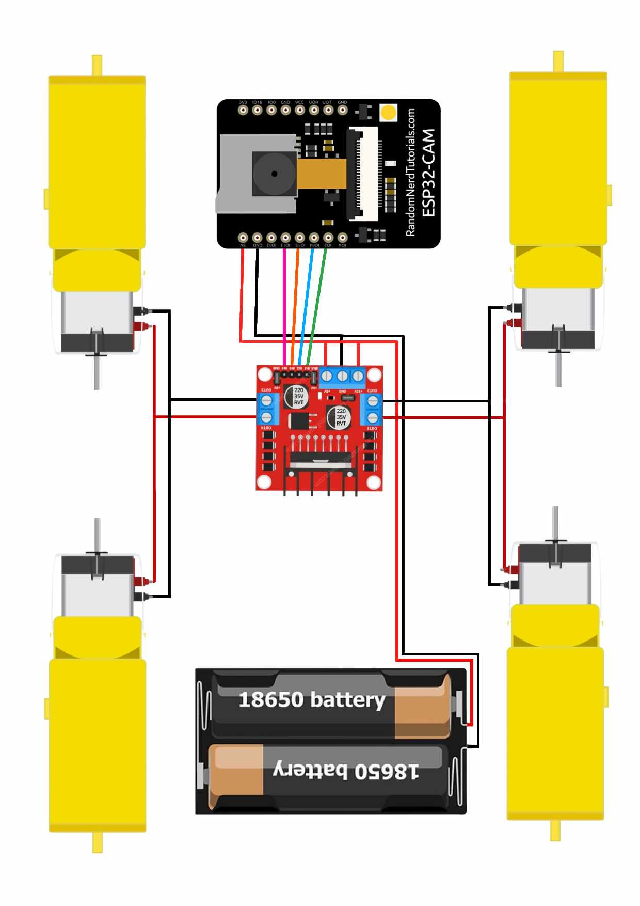

# 📷 What is ESP32CAM
The ESP32-CAM is a low-cost development board that integrates a camera module with the powerful ESP32 microcontroller, which supports Wi-Fi and Bluetooth. It is widely used for IoT projects, surveillance cameras, or smart home applications. Here are some key features:
- ESP32 microcontroller: It has dual-core processing, supports Wi-Fi and Bluetooth, and is used for networking and control tasks.
- Camera module: Typically, it comes with an OV2640 camera sensor capable of taking photos or video with a resolution of up to 1600x1200 pixels.
- MicroSD card support: The board has a slot for a MicroSD card for storage of images or video.
- GPIO pins: For integrating with other sensors or components.
- Low-power consumption: Useful for battery-powered projects.
The ESP32-CAM is popular for making DIY security cameras, face detection and recognition systems, or even live streaming video over Wi-Fi.
# 🎮 Key Features of L298N Motor Driver
1 Dual H-Bridge: It can drive two DC motors independently or one stepper motor.
2 Voltage Range: It operates between 5V to 35V, which makes it suitable for many DC motors.
3 Current: It can provide up to 2A per motor channel, with a peak current of 3A.
4 Control Pins: It has EN (Enable) pins to turn on or off the motors, and IN1, IN2, IN3, IN4 to control the direction of rotation.
5 PWM Support: You can control motor speed using Pulse Width Modulation (PWM) signals.
6 Built-in Heat Sink: To dissipate heat during prolonged use.

  

 
